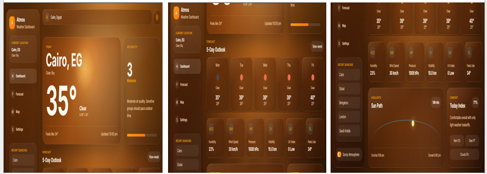
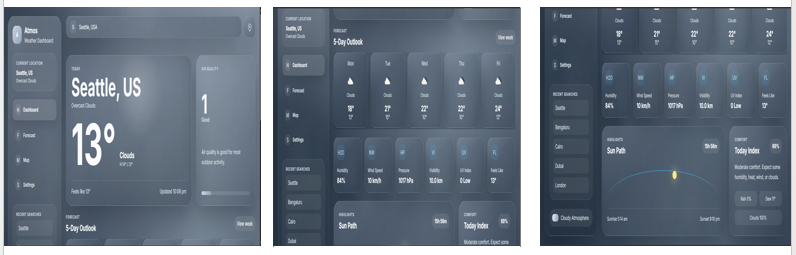
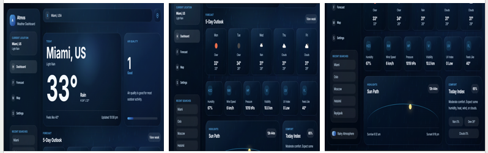
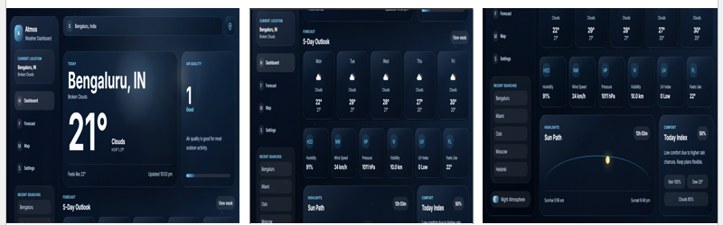

# 🌤️ Atmos Weather Dashboard

A modern, responsive, and visually immersive weather dashboard built using **HTML, CSS, and JavaScript**. The application provides real-time weather information, air quality details, forecasts, and dynamic atmospheric themes based on current weather conditions.

---

# ✨ Features

## 🌍 Real-Time Weather Information

- Search weather details by city name.
- Displays current temperature and weather conditions.
- Shows weather descriptions such as Sunny, Rainy, Cloudy, Snow, Storm, and Night.
- Displays high and low temperatures.

## 📍 Geolocation Support

- Detects and displays weather information based on the user's current location.
- One-click location access using browser geolocation.

## 🌈 Dynamic Weather Themes

The application automatically changes its appearance based on the current weather condition.

Supported Themes:

- ☀️ Sunny
- ☁️ Cloudy
- 🌧️ Rainy
- ❄️ Snow
- ⛈️ Storm
- 🌙 Night

## 🎨 Modern Animated UI

- Glassmorphism-inspired design
- Smooth animations and transitions
- Dynamic atmospheric background effects
- Modern responsive layout

## 🌬️ Detailed Weather Metrics

Displays:

- 🌡️ Temperature
- 🤗 Feels Like Temperature
- 💧 Humidity
- 🌬️ Wind Speed
- 🧭 Atmospheric Pressure
- 👀 Visibility
- ☀️ UV Index

## 🌫️ Air Quality Monitoring

- Real-time Air Quality Index (AQI)
- Air quality level and description
- Visual AQI indicator

## 🌅 Sun Information

- Sunrise Time
- Sunset Time
- Daylight Duration

## ☁️ Weather Forecast

- Multi-hour weather forecast
- Dynamic forecast cards

## 🔎 Recent Searches

- Recently searched cities
- Quick search access

## 📱 Fully Responsive

Works perfectly on:

- 📱 Mobile
- 💻 Laptop
- 🖥️ Desktop
- 📟 Tablet

---

# 🛠️ Technologies Used

- HTML5
- CSS3
- JavaScript (ES6)
- OpenWeatherMap API
- Open-Meteo API

---

# 📂 Project Structure

```text
├── assets/
│   └── screenshots/
├── index.html
├── style.css
├── script.js
└── README.md
```

---

# 🔑 API Setup

This project uses the **OpenWeatherMap API**.

### Step 1

Create a free account on OpenWeatherMap.

### Step 2

Generate your own API Key.

### Step 3

Open **script.js**

Replace:

```javascript
const API_KEY = "YOUR_OPENWEATHERMAP_API_KEY";
```

with your own API key.

Example:

```javascript
const API_KEY = "your_api_key_here";
```

---

# 🚀 How to Run

1. Clone or download this repository.
2. Get your free API key from OpenWeatherMap.
3. Open **script.js** and replace:

```javascript
const API_KEY = "YOUR_OPENWEATHERMAP_API_KEY";
```

with your own API key.

4. Save the file.
5. Open **index.html** in your browser.
6. Search for any city or use your current location.

Get your free API key here:

https://openweathermap.org/api

---

# 📸 Screenshots

### ☀️ Sunny Theme



### ☁️ Cloudy Theme



### 🌧️ Rainy Theme



### ❄️ Snow Theme


### ⛈️ Storm Theme


### 🌙 Night Theme



---

# 🔮 Future Enhancements

- 7-Day Weather Forecast
- Weather Maps Integration
- Dark / Light Theme Toggle
- Weather Alerts & Notifications
- Favorite Locations
- Weather History

---

# 👩‍💻 Author

**Janaki D**

